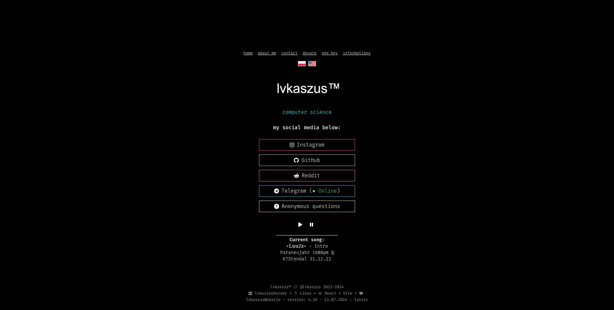

<h1>lvkaszusWebsite-React</h1>

Source Code of my public website (built with React + Vite)

  
[My Official Website](https://lvkasz.us)

<h2>Installation</h2>

If you want to deploy this website on your own server, follow these steps:

- Get a domain name and a server with preferably Linux installed on it   **Cloud Solutions with a Free-Tier: [Detailed list](https://github.com/cloudcommunity/Cloud-Free-Tier-Comparison)**

- Point your domain name to your server by editing DNS records in your domain registrar   **Detailed help: [OVHcloud](https://support.us.ovhcloud.com/hc/en-us/articles/360012042099-How-to-Connect-Your-VPS-to-Your-Domain-Name) / [GoDaddy](https://www.godaddy.com/help/change-an-a-record-19239) / [Namecheap](https://www.namecheap.com/support/knowledgebase/article.aspx/9837/46/how-to-connect-a-domain-to-a-server-or-hosting/)**

After that, connect to your server using SSH or other remote shell solution
- If you didn't receive other credentials besides password: $`ssh <username>@<ip_address>`
- If you got SSH private key: $`ssh -i <your_ssh_private_key_file_path> <username>@<ip_address>`

Update the package lists and packages on your system - if your server is running Debian/Ubuntu or any based-distro, it will look like this
- $`sudo apt update && sudo apt dist-upgrade`

Install NVM (Node Version Manager) by downloading and executing this script
- $`curl https://raw.githubusercontent.com/creationix/nvm/master/install.sh | bash`
  
  Also, execute commands that are displayed after installation of NVM:
  - $`export NVM_DIR="$HOME/.nvm"`
  - $`[ -s "$NVM_DIR/nvm.sh" ] && \. "$NVM_DIR/nvm.sh"`
  - $`[ -s "$NVM_DIR/bash_completion" ] && \. "$NVM_DIR/bash_completion"`

Install Node Runtime Environment
- $`nvm install node`
 
And finally, after installing all required packages - you can start by cloning this Git repository if you want to download latest version. **If you want to download major releases, go to [Releases](https://github.com/lvkaszus/lvkaszuswebsite-react/releases) page!**
- `git clone https://github.com/lvkaszus/lvkaszuswebsite-react`

Change directory to cloned repository
- `cd lvkaszuswebsite-react`

Install all project dependencies using NPM (Node Package Manager)
- $`npm install`

After installing all dependencies, begin building sources by using this command
- $`npm run build`

If building process has ended successfully - Just move all contents of the `dist/` folder to your NGINX web server index directory - for example: `/var/www/`
- $`sudo cp -r dist/ /var/www/mywebsite`
- $`sudo chown -R www-data:www-data /var/www/mywebsite`

And thats it! You can now install your SSL/TLS certificate to NGINX and finish setup of some other things.

<h2 align="center">Credits</h2>

- This project uses React library. (https://github.com/facebook/react)
- This project uses Vite library. (https://github.com/vitejs/vite)
- This project uses Axios library. (https://github.com/axios/axios)
- This project uses i18n for React library. (https://github.com/i18next/react-i18next)
- This project uses Font Awesome for React library. (https://github.com/FortAwesome/react-fontawesome)
- This project uses Fira Code font. (https://github.com/tonsky/FiraCode)
